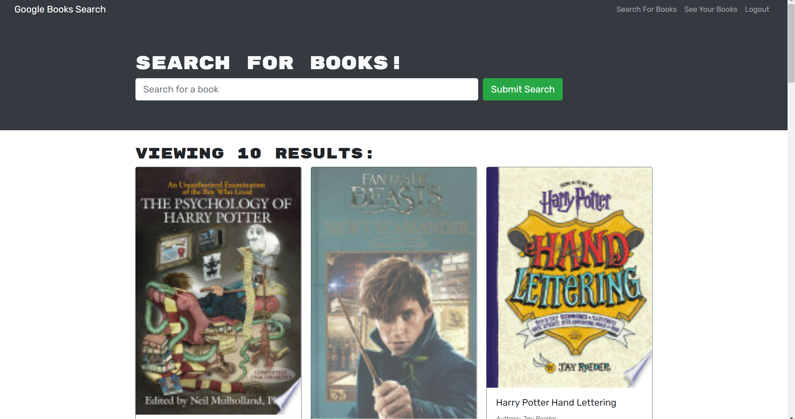

# Book-Search-Engine

## Description

  This application uses MongoDb, Express, React, and node technologies to create a book searching application. The application uses a google third party search api to search the internet for desired reading books and add them to a users list, after creating an account and logging in, if they wish. 

  ## Table of Contents

  - [Installation](#installation)
  - [Usage](#usage)
  - [Contributing](#contributing)
  - [License](#license)
  - [Tests](#tests)
  - [Questions](#questions)

  ## Installation

  To install this project, download the files from my repository at https://github.com/AndrewKamSki/Book-Search-Engine. From there run an 'npm install' in the console to load in the correct packages, then run a 'npm run develop' to start the application!

  ## Usage
  The application's deployed site can be found here: https://guarded-reaches-11344.herokuapp.com/

  Once on the main page, you can use the search bar to search for a book title.

  To add a book to your list, you have to be logged into an account. This can be done in the top right of the webpage 'login/signup'. When logged in and a book is searched, each book will present the option to add the book to your list. On the profile page, only books saved to the user's book list will be presented.
  
  

  ## Contributing

  No other contributors were on this project

  ## License
  The License being used is: MIT
  If you would like to read more on this please click the badge to navigate to the license page: 
  

  ## Tests

  No tests have been created yet for this project
  
  ## Questions

  If you would like to collaborate or have any questions feel free to contact me on my Github!
    - [My github](https://github.com/AndrewKamSki)
